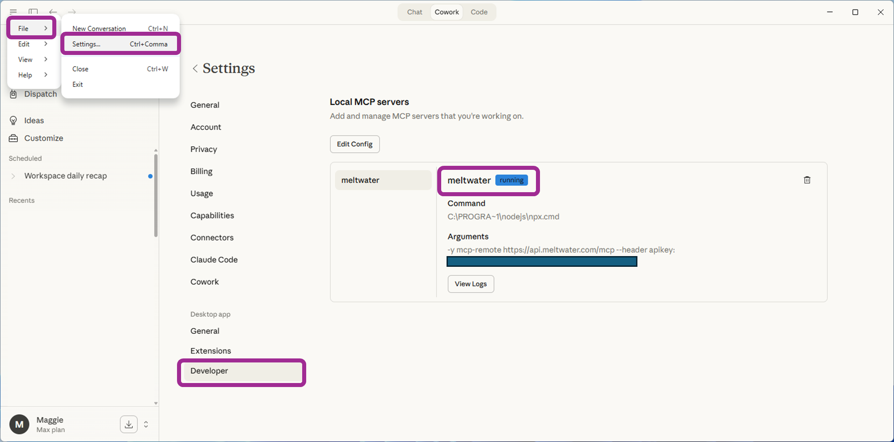
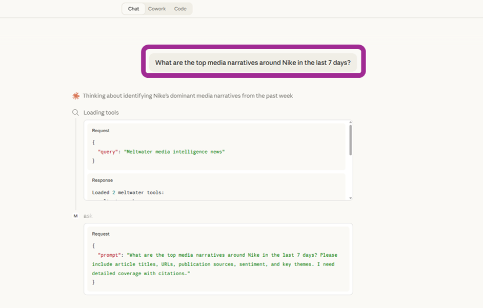
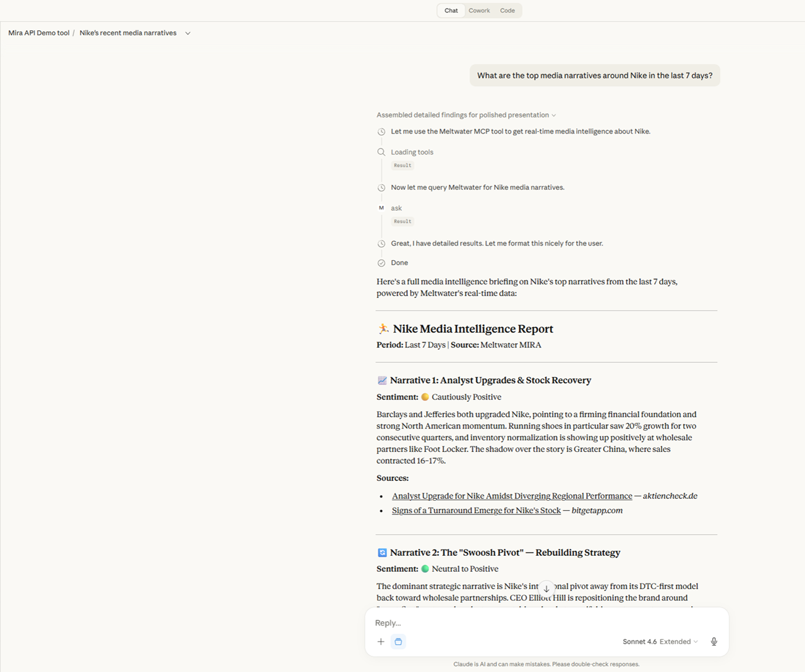
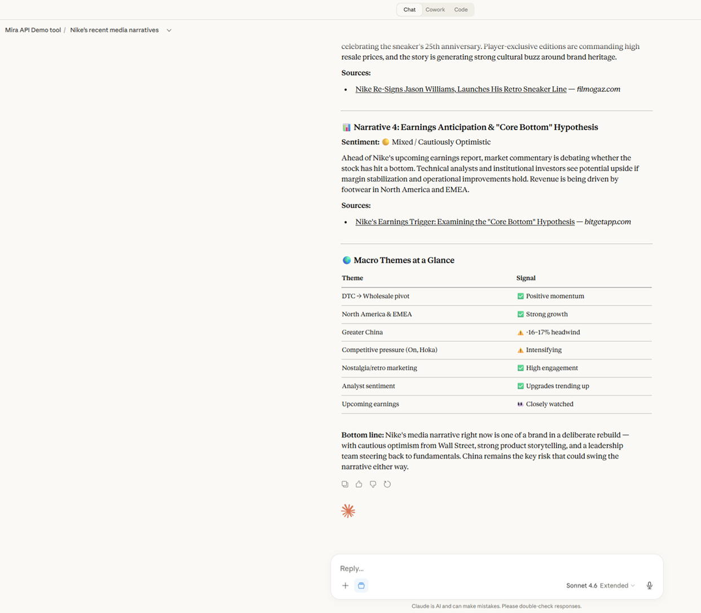
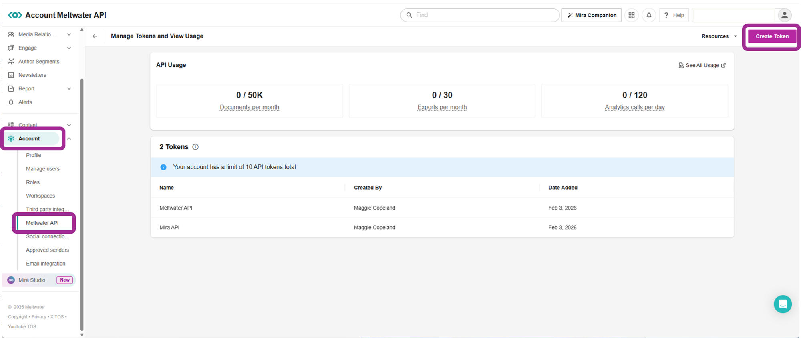

# Mira API MCP Server Demo Guide [Sales]

**Privileged & Confidential. Internal Only.**
Product Marketing | March 2026

---

## What is this guide?

This is a step-by-step demo guide for showing prospects how the Mira API works inside an MCP-compatible tool. You run a live, conversational demo where the prospect sees Meltwater intelligence delivered directly inside the tools their team already uses.

**Use this guide when:** A prospect's team wants to embed Meltwater insights into internal tools, AI assistants, or workflows, and you want to show how easy that looks in practice.

**Use the standard Mira API demo ([Developer page](#02-b-developer-page-walkthrough-path-b)) when:** The prospect has a technical buyer who wants to see the API documentation, request structure, and endpoint behavior. Walk them through the [Mira API Developer page](https://developer.meltwater.com/docs/meltwater-api/mira-api/overview/) directly.

**Use the Mira Studio demo when:** The prospect's team will use Meltwater's built-in UI to access insights directly. No integration needed.

---

## Key Terms

Before diving in, here are the terms you'll use in this demo. You don't need to memorize technical definitions, just know what they mean in plain language.

**Mira API:** The way customers connect Mira AI into their own tools. Instead of logging into Meltwater, their systems ask Meltwater questions directly and get answers back.

**MCP (Model Context Protocol):** Think of it as a plug that connects an AI tool to a data source. Plug it in, and the AI tool can talk to Meltwater. This is an open standard that any AI tool can support.

**MCP server:** The connector file that tells an AI tool how to reach the Mira API. A small configuration file, about five minutes to set up.

**MCP-compatible tool:** Any AI assistant that supports MCP connections. Claude Desktop, Cursor, and others. This is the tool you'll demo from.

**Mira Project:** A saved set of context in Meltwater (brand, competitors, topics, filters) that makes Mira's responses more relevant without the user needing to repeat background info in every prompt.

**Streaming:** When the response appears word by word in real time (like ChatGPT) instead of loading all at once.

---

## How MCP fits into the Mira API story

The Mira API lets customers bring Mira AI-powered responses into their own tools. MCP (Model Context Protocol) is one way to do that (see Key Terms above). It connects the Mira API to AI assistants so users can ask Meltwater questions in natural language, from inside the tools they already work in.

**What to say:**
"Your team doesn't have to open Meltwater to get Meltwater insights. The Mira API delivers the same intelligence your team sees in Mira Studio: brand coverage, media trends, sentiment, competitive analysis. All of that, directly into the tools your people already use. MCP is the connector that makes that happen. No custom code needed."

**What MCP actually is:**
A configuration layer on top of the Mira API. Same intelligence, same cited responses, just delivered through a different channel.

**How it all connects:**


---

## Pre-Requisites

Before you demo, make sure you have:

- [ ] An MCP-compatible tool installed and configured (e.g., Claude Desktop, Cursor, or another MCP host)
- [ ] The Mira API MCP server connected to your tool (the connector file that links your AI tool to Meltwater)
- [ ] An active Meltwater API key tied to your demo/buddy account
- [ ] A Mira Project set up for the brand you plan to demo (this pre-loads brand context so Mira's answers are more relevant)
- [ ] All prompts tested in your buddy account before the live call

**Tip:** Run through the full demo flow at least once before any customer-facing call. MCP connections can take a moment to initialize, and you want to know what the output looks like for your chosen brand.

---

## MCP Setup Checklist (Claude Desktop)

If you're using Path A (Live MCP Demo), follow these steps to connect Claude Desktop to the Mira API. Do this well before your demo call, not five minutes before.

Personal note: the author of this guide connected the Mira API to Claude Desktop on her second day using Claude, with zero technical background. If I can do it, you can, too. 🐥

**Step 1: Install Node.js (if you don't have it already)**

The MCP connection requires Node.js to run. This is the one thing the Developer docs don't mention that will trip you up.

1. Go to [https://nodejs.org](https://nodejs.org).
2. If you're not sure whether you already have it, just download and install the LTS version. It won't cause issues if it's already installed.
3. Run the installer and accept the defaults.

**Step 2: Get your Meltwater API key**

Follow the steps in Troubleshooting ("I don't have an API key") or the [API Credentials page](https://developer.meltwater.com/docs/meltwater-api/getting-started/api-credentials/) to find or create your token from Account > Meltwater API in your buddy account. Copy it somewhere safe.

**Important: never share or display your API key on screen during a live demo.** If your screen is visible to the prospect, make sure the key is hidden or obfuscated before you show any config files or browser tabs where the key is visible.

**Step 3: Open the Claude Desktop config file**

The easiest way: in Claude Desktop, go to **Settings > Developer > Edit Config**. This opens the config file directly.

If that doesn't work, find the file manually:
- **Mac:** `~/Library/Application Support/Claude/claude_desktop_config.json`
- **Windows:** `%APPDATA%\Claude\claude_desktop_config.json`

**Step 4: Paste the config**

Replace everything in the file with the following, swapping in your real API key where it says `<your api key>`:

```json
{
  "mcpServers": {
    "meltwater": {
      "command": "npx",
      "args": [
        "-y",
        "mcp-remote",
        "https://api.meltwater.com/mcp",
        "--header",
        "apikey: ${MELTWATER_API_KEY}"
      ],
      "env": {
        "MELTWATER_API_KEY": "<your api key>"
      }
    }
  }
}
```

**Step 5: Save and restart Claude Desktop**

Save the config file, then fully quit and reopen Claude Desktop. The MCP connection won't activate until you restart.

**Step 6: Verify it works**

Open a new conversation in Claude Desktop. You should see "meltwater" listed as an available tool. Type a test prompt like "What are the top media narratives around Nike in the last 7 days?" and confirm you get a cited response.



If it doesn't work, check the Troubleshooting section below.

---

## Which demo path should you use?

Before you start, figure out which path fits your situation.

| If you have... | Use this path |
|----------------|---------------|
| An MCP-compatible tool with the Mira connector set up | **Path A: Live MCP Demo** (sections 01–02 below) |
| No MCP setup, or you're not comfortable running it live | **[Path B: Developer Page Walkthrough](#02-b-developer-page-walkthrough-path-b)** (section 02-B below) |

Both paths end at the same place: the prospect understands that the Mira API delivers Meltwater intelligence into their team's tools. Path A shows it live. Path B shows what it looks like under the hood using the Developer Documentation, and you can pair it with the MCP demo GIF/video.

---

## 01: Choose a Use Case

Pick a use case that maps to your prospect's world. The three below work well for MCP demos because they produce rich, cited responses that show the value immediately.

### Brand Coverage Overview

**Best for:** PR, comms, and marketing teams who need quick media intelligence on demand.

**Sample prompt:**
"What are the top media narratives around [Brand] in the last 7 days?"

**What the prospect sees:** A structured overview with key themes, sentiment, source citations, and embedded links, all inside the tool they already have open.

### Competitive Comparison

**Best for:** Strategy and marketing teams tracking share of voice and competitive positioning.

**Sample prompt:**
"Compare recent news coverage for [Brand] and [Competitor] in [Industry/Topic] over the past two weeks."

**What the prospect sees:** A side-by-side breakdown of how both brands are being covered, with themes, tone, and volume differences highlighted.

### Industry Trend Analysis

**Best for:** Analyst and insights teams monitoring category-level shifts.

**Sample prompt:**
"What innovations are receiving the most media coverage in [Industry] in [Region] right now?"

**What the prospect sees:** A landscape view of what's driving coverage in their space, with specific examples and citations.

---

## 02: Demo Flow

### Step 1: Set the hook

**What to say:**
"What if your team could ask Meltwater a question without ever opening Meltwater?"


"Your teams are spread across different tools. Analysts log into Meltwater. Comms teams work in Slack. Executives want briefings in email. The Mira API closes that gap. Meltwater's intelligence, delivered wherever your people already work."

### Step 2: Show the tool

Open your MCP-compatible tool. Show the prospect that this is a standard interface. Nothing custom-built, nothing exotic.


**What to say:**
"What I'm showing you is [tool name] connected to the Mira API through MCP, which stands for Model Context Protocol. It's an open standard that lets AI tools connect to data sources. It took about five minutes to set up. No code, no deployment, no IT ticket."

### Step 3: Run a live prompt

Type your chosen prompt (from the use cases above) directly into the tool.

**What to say:**
"I'm going to ask the same question a user on your team would type into Mira Studio. But instead of opening Meltwater, I'm asking it right here."

**What to do:** Type the prompt. Wait for the response to generate.



"Watch what comes back. This is a real call to the Mira API. The same data, the same intelligence, the same cited sources you'd see in Mira Studio. Delivered right here."

### Step 4: Walk through the response

Once the response appears, highlight three things:





1. **The overview is structured.** Point out how the response organizes themes, trends, or sentiment into clear sections.
2. **Sources are cited.** Every claim links back to a specific article. "This matters for compliance teams and publisher agreements. Every insight is sourced."
3. **Analysis, not raw articles.** "What you're seeing is Meltwater's analysis with citations. The API delivers the intelligence layer, so your team gets the takeaway without reading through hundreds of articles."

### Step 5: Run a follow-up

Type a natural follow-up question in the same conversation.

**Example follow-ups:**
- "Tell me more about [theme from the response]."
- "What's the sentiment breakdown on this?"
- "Draft a briefing for my VP based on these findings."

**What to say:**
"The Mira API supports multi-turn conversations. Mira remembers what was asked earlier in the session, so the follow-up builds on the first answer. This is how you'd build an exec briefing assistant that keeps the full thread of context."

### Step 6: Show Mira Projects (optional but recommended)

If you have a Mira Project configured, mention it.

**What to say:**
"One more thing. I've connected this to a Mira Project I set up in the platform. That project holds the brand context, competitors, focus topics, and preferred filters. So every question I ask is already grounded in what matters to this team. No prompt engineering required on the user's end."

---

## 02-B: Developer Page Walkthrough (Path B)

Use this path if you don't have MCP set up, or if you'd rather walk the prospect through the documentation directly. You'll need two Chrome tabs open before the call:

1. [Mira API Overview](https://developer.meltwater.com/docs/meltwater-api/mira-api/overview/) (for context)
2. [API Endpoints](https://developer.meltwater.com/docs/meltwater-api/reference/endpoints/#/Mira%20API/post_v3_mira_responses) (for the live demo)

You'll also need your API key from your buddy account (see Troubleshooting if you don't have one).

**Important: before you share your screen, make sure your API key is not visible in any open tab.** Pre-authenticate the Endpoints page before the call so you don't have to type or paste your key while the prospect is watching.

### Step 1: Set the hook (same as Path A)

**What to say:**
"What if your team could ask Meltwater a question without ever opening Meltwater?"


"The Mira API makes that possible. Let me show you what it looks like."

### Step 2: Show the Overview page (context)

Switch to the [Mira API Overview](https://developer.meltwater.com/docs/meltwater-api/mira-api/overview/) tab. Spend about 30 seconds here to set context.

> **[Screenshot: The Mira API Overview page in Chrome]**

**What to say:**
"This is the Mira API Developer page. This is where your technical team would go to set up the integration. I'll give you the quick version."

Point out two things:

1. **The data source.** "Meltwater already ingests data from news and social sources, enriches it with AI analysis, and makes it available through this API. Your team doesn't need to build any of that. They just connect."

2. **Two ways to connect.** "There are two options: the Responses endpoint, which is the core API, and the MCP Server, which lets AI tools like Claude Desktop connect directly. Both deliver the same intelligence."

### Step 3: Switch to the Endpoints page (live demo)

Switch to your [API Endpoints](https://developer.meltwater.com/docs/meltwater-api/reference/endpoints/#/Mira%20API/post_v3_mira_responses) tab. This page has an interactive Swagger UI where you can fire a real API request from the browser.

> **[Screenshot: The API Endpoints page showing the Swagger UI with endpoint list]**

**What to say:**
"Now let me show you what this looks like in real time. I'm going to send a live request to the Mira API right from this page."

### Step 4: Run a live request with "Try it out"

Find the Mira Responses endpoint in the Swagger UI. Click **Try it out**.

**Important: the default request body has placeholder values that will cause an error if you don't replace them.** Before hitting Execute, replace the entire request body with the text below, swapping in the prospect's brand:

```json
{
  "input": [
    {
      "role": "user",
      "content": [
        {
          "type": "text",
          "text": "What are the top media narratives around [Brand] in the last 7 days?"
        }
      ]
    }
  ],
  "stream": false
}
```

Then:

1. Confirm your API key is entered in the `apikey` header field. (Do this before sharing your screen so the key stays hidden.)
2. Make sure the request body above is pasted in with your prospect's brand name.
3. Click **Execute**.

> **[Screenshot: The Swagger UI with the request filled in and the Execute button visible]**

**What to say while it runs:**
"This is a real call to the Mira API. I'm asking it the same kind of question your team would ask inside Mira Studio. But instead of opening the platform, the API delivers the answer directly."

### Step 5: Walk through the response

Once the response loads in the Swagger UI, scroll to the response body.

> **[Screenshot: The Swagger UI response body showing structured analysis and citations]**

**What to point out:**
- The response is structured analysis, organized by themes, trends, or sentiment. "This is ready to use. No manual formatting needed."
- Citations link back to specific sources. "Every insight is sourced. That matters for compliance and publisher agreements."
- "Your team can get this same response inside their own tools, whether that's a chatbot, an internal app, or an AI assistant like Claude."

### Step 6: Show the MCP demo GIF or video

After the live request, pull up the Mira API MCP Demo GIF or video to show what the end-user experience looks like.

**What to say:**
"That was the API under the hood. Now here's what it looks like for the end user."

> **[Screenshot/GIF: The Mira API MCP Demo GIF from the Slack Canvas]**

Play the GIF/video. Let the prospect watch the full flow.

"A question typed in plain language, a cited response from Meltwater, all inside a tool their team already uses. Setup takes about five minutes."

### Step 7: Hand off to the technical buyer

**What to say:**
"If your team wants to try this, I can connect you with our team to set up a trial. The Developer page has everything they need to get started, and we can walk them through it."

---

## 03: Guardrails

There are two things to flag before a deal closes:

1. **No resale.** Customers can't resurface Mira insights in a product they charge for. This is for internal use only. If a prospect wants to build something customer-facing with Mira outputs, that's a different conversation.

2. **No full article text for LLM training.** The API returns analysis and citations, not raw article content. If a prospect is looking for full-text data to train their own models, that's not what the Mira API provides.

**Flag these early.** If either of these applies, flag it to the Solutions Agent in Slack.

---

## 04: Handling Common Questions

**"How is this different from just using ChatGPT with web search?"**
Mira is built on Meltwater's proprietary dataset: real-time news, social media, broadcast, and print sources, all enriched with topics, entities, and sentiment. ChatGPT pulls from the open web with no guarantees on source quality, coverage, or consistency. Mira's responses are cited, reproducible, and grounded in data your team already trusts.

**"Does the customer need to install anything?"**
They need an AI tool that supports MCP (like Claude Desktop) and the Mira connector file. Setup takes about five minutes. No custom development required.

**"Is this the same data as Mira Studio?"**
Yes. The same content, and intelligence as Mira Studio. The only difference is where the response shows up. 

**"What if my customer's team isn't technical?"**
That's exactly who this is for. MCP means they type a question in plain language and get a cited response. No technical setup on their end, no code.

**"What are the pricing tiers?"**
There are five tiers from Trial to Elite. The Trial is a great first step: 500 prompts over 90 days, enough to build and validate a use case. If they need more headroom mid-trial, the add-on pack gives them 500 extra prompts for $2,500.

**"Do answers appear in real time, or does the user have to wait?"**
Answers stream in word by word, just like ChatGPT. The user sees the response building in real time. This works the same way through MCP.

---

## 05: Troubleshooting

Common issues reps run into before or during the demo, and how to fix them.

**"I don't have an API key."**
You should already have access through your buddy account. Full instructions are on the [API Credentials page](https://developer.meltwater.com/docs/meltwater-api/getting-started/api-credentials/). Here's the quick version:

1. Log into your Meltwater buddy account.
2. In the left sidebar, go to **Account** > **Meltwater API**.
3. You'll see your existing tokens listed under **Tokens**. If you need a new one, click **Create Token** (red button, top right).
4. Name the token something descriptive and click OK.
5. Copy the token immediately. You won't be able to see it again after you leave the page.



If you don't see "Meltwater API" in your sidebar, your buddy account may not have API access enabled. Flag it to the Solutions Agent in Slack to get it turned on.

Note for prospects: customers receive their API key after they purchase and begin onboarding. They won't have one during the sales process.

**"My MCP tool isn't connecting to Meltwater."**
Check these in order:

1. **Is Node.js installed?** If you skipped Step 1 of the MCP Setup Checklist, go to [https://nodejs.org](https://nodejs.org) and install the LTS version first.
2. **Is your API key correct?** Make sure the key in the config file matches the token from your buddy account (Account > Meltwater API). Copy-paste it again to be safe.
3. **Did you restart Claude Desktop?** The config only loads on startup. Fully quit and reopen the app.
4. **Is the config file formatted correctly?** A missing comma or bracket will break it silently. If you're not sure, paste your config into [jsonlint.com](https://jsonlint.com) and click "Validate" to check.

If none of that works, try deleting the config, restarting Claude Desktop, then re-adding the config and restarting again.

**"How do I set up MCP in the first place?"**
Follow the MCP Setup Checklist earlier in this guide. For the full Developer docs version, see the [MCP Server docs page](https://developer.meltwater.com/docs/meltwater-api/mira-api/mcp-server/). Note: the docs lead with an OpenAI example first. Scroll down to the "Integrating with Claude Desktop" section for the config you need.

**"I got an error about npx or mcp-remote not being found."**
This means Node.js isn't installed or didn't install correctly. Go to [https://nodejs.org](https://nodejs.org), download and install the LTS version again, then restart your computer and Claude Desktop.

**"The response came back empty or with an error."**
This usually means one of two things: your API key is expired or invalid, or your prompt quota has been reached. Flag it to the Solutions Agent in Slack to confirm your key is active and your account has remaining prompts.

**"The response is too generic or missing context about the brand."**
Set up a Mira Project for the brand you're demoing. Without a Project, Mira answers based only on the prompt. With a Project, it pulls in your saved brand context, competitors, and filters automatically.

**"I don't have time to set up MCP before the call."**
Use Path B (Developer Page Walkthrough). Open the [Mira API Developer page](https://developer.meltwater.com/docs/meltwater-api/mira-api/overview/) in Chrome and pair it with the MCP demo GIF. You can run a compelling demo without any local setup.

**"The prospect asked me a technical question I can't answer."**
That's fine. Say: "Great question. Let me connect you with our team who can walk your technical team through the details." Then flag the question to the Solutions Agent in Slack after the call.

---

## 06: Resources

**Developer Documentation**
- [Mira API Overview](https://developer.meltwater.com/docs/meltwater-api/mira-api/overview/) | [Responses Endpoint](https://developer.meltwater.com/docs/meltwater-api/mira-api/responses/) | [MCP Server Setup](https://developer.meltwater.com/docs/meltwater-api/mira-api/mcp-server/) | [API Credentials](https://developer.meltwater.com/docs/meltwater-api/getting-started/api-credentials/)
- [API Endpoints / Swagger UI](https://developer.meltwater.com/docs/meltwater-api/reference/endpoints/#/Mira%20API/post_v3_mira_responses) (use for Path B live demo)

**Demo Assets**
- [Mira API MCP Demo GIF](https://meltwater-3.wistia.com/medias/x5c95xb5gz) (Wistia, shareable with prospects)
- [Mira API Technical Diagram](https://docs.google.com/presentation/d/1lqofldVT5sQMH10lZ3tviuv9BwJOVXBbJZoqdlxOEFA/edit?slide=id.g3cdb1fb610a_0_15#slide=id.g3cdb1fb610a_0_15) (Google Slides, shareable with prospects)

**Adding images to this guide on GitHub:** To embed the diagram or GIF directly in this page, download the image file, upload it to this repo, and add `` where you want it to appear.

**Follow-up email template:** See [mira-api-demo-followup-email.md](mi
