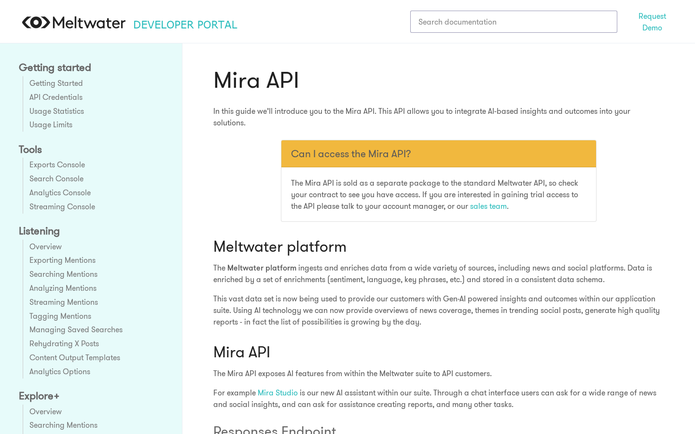
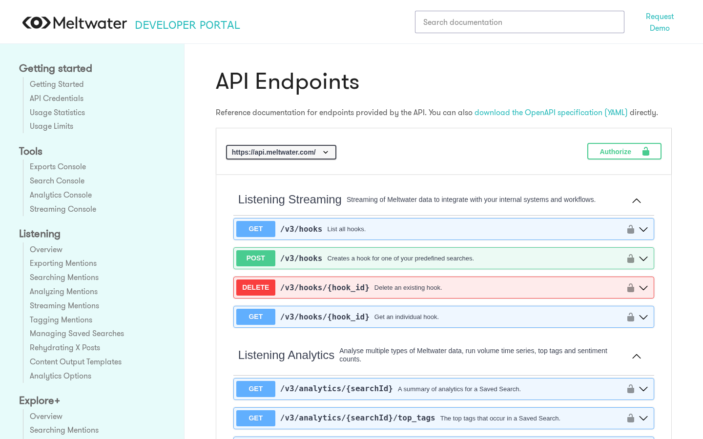
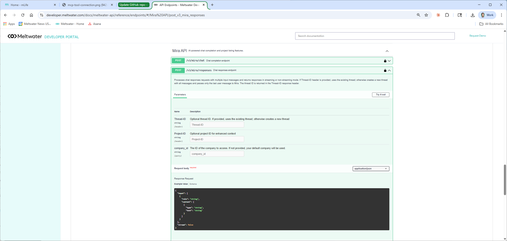
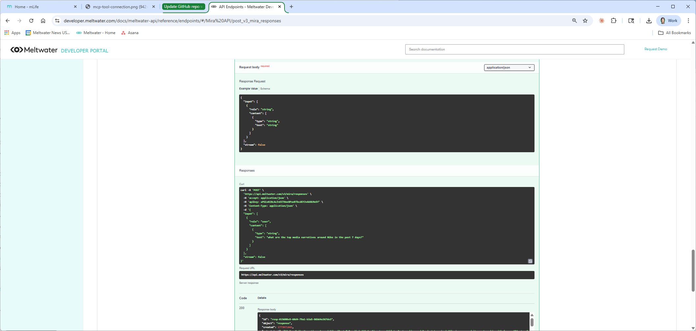

# Mira API MCP Server: Setup & Testing Guide

**Internal Only.**
Product Marketing | March 2026

---

## What is this guide?

A step-by-step guide for connecting the Mira API to an MCP-compatible tool and verifying it works. This covers two ways to access the Mira API:

1. **MCP connection** — Connect an AI tool (like Claude Desktop) to the Mira API so you can query Meltwater in natural language from inside the tool.
2. **Developer page "Try it out"** — Test the Mira API directly from the Developer Documentation page in your browser. No local setup required.

---

## Key Terms

**Mira API:** The way customers connect Mira AI into their own tools. Instead of logging into Meltwater, their systems ask Meltwater questions directly and get answers back.

**MCP (Model Context Protocol):** Think of it as a plug that connects an AI tool to a data source. Plug it in, and the AI tool can talk to Meltwater. This is an open standard that any AI tool can support.

**MCP server:** The connector file that tells an AI tool how to reach the Mira API. A small configuration file, about five minutes to set up.

**MCP-compatible tool:** Any AI assistant that supports MCP connections. Claude Desktop, Cursor, and others.

**Mira Project:** A saved set of context in Meltwater (brand, competitors, topics, filters) that makes Mira's responses more relevant without the user needing to repeat background info in every prompt.

**Streaming:** When the response appears word by word in real time (like ChatGPT) instead of loading all at once.

---

## How MCP connects to the Mira API

The Mira API lets customers bring Mira AI-powered responses into their own tools. MCP is one way to do that. It connects the Mira API to assistants so users can ask Meltwater questions in natural language, from inside the tools they already work in.

MCP is a configuration layer on top of the Mira API. Same intelligence, same cited responses, just delivered through a different channel. 


---

## Option 1: MCP Setup (Claude Desktop)

Follow these steps to connect Claude Desktop to the Mira API.

Personal note: the author of this guide connected the Mira API to Claude Desktop on her second day using Claude, with zero technical background. If I can do it, you can, too. 🐥

### Step 1: Install Node.js (if you don't have it already)

The MCP connection requires Node.js to run. This is the one thing the Developer docs don't mention that will trip you up.

1. Go to [https://nodejs.org](https://nodejs.org).
2. If you're not sure whether you already have it, just download and install the LTS version. It won't cause issues if it's already installed.
3. Run the installer and accept the defaults.

### Step 2: Get your Meltwater API key

Follow the steps in Troubleshooting ("I don't have an API key") or the [API Credentials page](https://developer.meltwater.com/docs/meltwater-api/getting-started/api-credentials/) to find or create your token from Account > Meltwater API in your buddy account. Copy it somewhere safe.

**Important: never share or display your API key on screen during a live call or recording.** If your screen is visible, make sure the key is hidden or obfuscated before you show any config files or browser tabs where the key is visible.

### Step 3: Open the Claude Desktop config file

The easiest way: in Claude Desktop, go to **Settings > Developer > Edit Config**. This opens the config file directly.

If that doesn't work, find the file manually:
- **Mac:** `~/Library/Application Support/Claude/claude_desktop_config.json`
- **Windows:** `%APPDATA%\Claude\claude_desktop_config.json`

### Step 4: Paste the config

Replace everything in the file with the following, swapping in your real API key where it says `<your api key>`:

```json
{
  "mcpServers": {
    "meltwater": {
      "command": "npx",
      "args": [
        "-y",
        "mcp-remote",
        "https://api.meltwater.com/mcp",
        "--header",
        "apikey: ${MELTWATER_API_KEY}"
      ],
      "env": {
        "MELTWATER_API_KEY": "<your api key>"
      }
    }
  }
}
```

### Step 5: Save and restart Claude Desktop

Save the config file, then fully quit and reopen Claude Desktop. The MCP connection won't activate until you restart.

### Step 6: Verify it works

Open a new conversation in Claude Desktop. You should see "meltwater" listed as an available tool. Type a test prompt like "What are the top media narratives around Nike in the last 7 days?" and confirm you get a cited response.


If it doesn't work, check the Troubleshooting section below.

### Getting enriched responses with citations

By default, Claude may summarize the Mira API response without including the original source links. To ensure every response includes structured sections, sentiment labels, and cited sources with article titles and URLs, create a Claude Desktop Project. Go to **Projects** in the sidebar, create a new Project (e.g., "Mira API Demo"), and add instructions like:

> *"For every question, use the Meltwater MCP tool to retrieve real-time media intelligence. Always include the original source citations with article titles and URLs in your response. Format the response with clear sections, sentiment labels, and cited sources."*

Select this Project before running your prompts. This ensures the response comes back fully enriched every time, without needing to add extra instructions to each prompt.

---

## Option 2: Test from the Developer Page (no local setup)

If you want to test the Mira API without installing anything locally, you can send a live request directly from the Developer Documentation page. The page has a built-in "Try it out" feature that lets you type a question and see the API response right in your browser.

You'll need two Chrome tabs:

1. [Mira API Overview](https://developer.meltwater.com/docs/meltwater-api/mira-api/overview/) (for reference)
2. [API Endpoints](https://developer.meltwater.com/docs/meltwater-api/reference/endpoints/#/Mira%20API/post_v3_mira_responses) (for testing)

You'll also need your API key from your buddy account (see Troubleshooting if you don't have one).

### Step 1: Open the Overview page

The [Mira API Overview](https://developer.meltwater.com/docs/meltwater-api/mira-api/overview/) page covers access requirements and the two main integration paths: the Responses endpoint (core API) and the MCP Server (AI tool connector).



### Step 2: Open the Endpoints page

Switch to the [API Endpoints](https://developer.meltwater.com/docs/meltwater-api/reference/endpoints/#/Mira%20API/post_v3_mira_responses) tab. This page has a built-in testing tool where you can send a real API request from the browser.



### Step 3: Authenticate

Click the **Authorize** button and enter your API key. Do this before sharing your screen if you're on a call.

### Step 4: Send a test request

Find the Mira Responses endpoint. Click **Try it out**.

**Important: the default request body has placeholder values that will cause an error if you don't replace them.** Replace the entire request body with:

```json
{
  "input": [
    {
      "role": "user",
      "content": [
        {
          "type": "text",
          "text": "What are the top media narratives around Nike in the last 7 days?"
        }
      ]
    }
  ],
  "stream": false
}
```

Swap in any brand you want to test. Then click **Execute**.



### Step 5: Review the response

The response will appear below the request. It contains structured analysis organized by themes, with sentiment and cited sources.



Things to look for:

- **Structured overview** with themes, trends, and sentiment labels
- **Source citations** linking back to specific articles
- **Analysis, not raw articles.** The API delivers the intelligence layer with citations, not full article text.

---

## Troubleshooting

**"I don't have an API key."**
You should already have access through your buddy account. Full instructions are on the [API Credentials page](https://developer.meltwater.com/docs/meltwater-api/getting-started/api-credentials/). Here's the quick version:

1. Log into your Meltwater buddy account.
2. In the left sidebar, go to **Account** > **Meltwater API**.
3. You'll see your existing tokens listed under **Tokens**. If you need a new one, click **Create Token** (red button, top right).
4. Name the token something descriptive and click OK.
5. Copy the token immediately. You won't be able to see it again after you leave the page.


If you don't see "Meltwater API" in your sidebar, all buddy accounts should have access. Reach out to support to get it resolved.

Note for customer-facing context: customers receive their API key after purchase during onboarding. They won't have one during the sales process.

**"My MCP tool isn't connecting to Meltwater."**
Check these in order:

1. **Is Node.js installed?** If you skipped Step 1 of the MCP setup, go to [https://nodejs.org](https://nodejs.org) and install the LTS version first.
2. **Is your API key correct?** Make sure the key in the config file matches the token from your buddy account (Account > Meltwater API). Copy-paste it again to be safe.
3. **Did you restart Claude Desktop?** The config only loads on startup. Fully quit and reopen the app.
4. **Is the config file formatted correctly?** A missing comma or bracket will break it silently. If you're not sure, paste your config into [jsonlint.com](https://jsonlint.com) and click "Validate" to check.

If none of that works, try deleting the config, restarting Claude Desktop, then re-adding the config and restarting again.

**"How do I set up MCP in the first place?"**
Follow Option 1 above. For the full Developer docs version, see the [MCP Server docs page](https://developer.meltwater.com/docs/meltwater-api/mira-api/mcp-server/). Note: the docs lead with an OpenAI example first. Scroll down to the "Integrating with Claude Desktop" section for the config you need.

**"I got an error about npx or mcp-remote not being found."**
This means Node.js isn't installed or didn't install correctly. Go to [https://nodejs.org](https://nodejs.org), download and install the LTS version again, then restart your computer and Claude Desktop.

**"The response came back empty or with an error."**
This usually means one of two things: your API key is expired or invalid, or your prompt quota has been reached. Flag it to the Solutions Agent in Slack to confirm your key is active and your account has remaining prompts.

**"The response is too generic or missing context about the brand."**
Set up a Mira Project for the brand you're testing. Without a Project, Mira answers based only on the prompt. With a Project, it pulls in your saved brand context, competitors, and filters automatically.

---

## Resources

**Developer Documentation**
- [Mira API Overview](https://developer.meltwater.com/docs/meltwater-api/mira-api/overview/) | [Responses Endpoint](https://developer.meltwater.com/docs/meltwater-api/mira-api/responses/) | [MCP Server Setup](https://developer.meltwater.com/docs/meltwater-api/mira-api/mcp-server/) | [API Credentials](https://developer.meltwater.com/docs/meltwater-api/getting-started/api-credentials/)
- [API Endpoints / "Try it out"](https://developer.meltwater.com/docs/meltwater-api/reference/endpoints/#/Mira%20API/post_v3_mira_responses) (for live testing)

**Demo Assets**
- [Mira API MCP Demo Video](https://meltwater-3.wistia.com/medias/x5c95xb5gz) (Wistia)
- [Mira API Technical Diagram](https://docs.google.com/presentation/d/1lqofldVT5sQMH10lZ3tviuv9BwJOVXBbJZoqdlxOEFA/edit?slide=id.g3cdb1fb610a_0_15#slide=id.g3cdb1fb610a_0_15) (Google Slides)

---

*Questions or feedback? Reach out to PMM in #product-api.*

*Co-authored with Claude, Anthropic*
