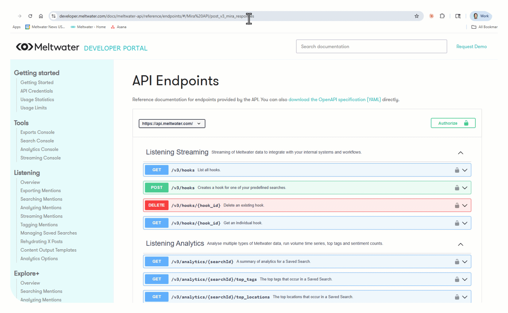

# Mira API MCP Server: Setup & Testing Guide

**Internal Only.**
Product Marketing | March 2026

---

## What is this guide?

A step-by-step guide for connecting the Mira API to an MCP-compatible tool and verifying it works. This covers two ways to access the Mira API:

1. **MCP connection.** Connect an AI tool (like Claude Desktop) to the Mira API so you can query Meltwater in natural language from inside the tool.
2. **Developer page "Try it out."** Test the Mira API directly from the Developer Documentation page in your browser. No local setup required.

---

## Key Terms

**Mira API:** The way customers connect Mira AI into their own tools. Instead of logging into Meltwater, their systems ask Meltwater questions directly and get answers back.

**MCP (Model Context Protocol):** Think of it as a plug that connects an AI tool to a data source. Plug it in, and the AI tool can talk to Meltwater. This is an open standard that any AI tool can support.

**MCP server:** The connector file that tells an AI tool how to reach the Mira API. A small configuration file, about five minutes to set up.

**MCP-compatible tool:** Any AI assistant that supports MCP connections. Claude Desktop, Cursor, and others.

**Mira Project:** A saved set of context in Meltwater (brand, competitors, topics, filters) that makes Mira AI's responses more relevant without the user needing to repeat background info in every prompt. Mira Projects can also include saved Explore searches, which give Mira AI access to a specific, curated set of results to draw from.

**Claude Desktop Project:** A set of saved instructions inside Claude Desktop that tell Claude how to behave in a conversation. Not the same as a Mira Project. You'll use a Claude Desktop Project to tell Claude to automatically find your Mira Projects and use their saved searches when answering questions. See Step 7 for setup.

**Streaming:** When the response appears word by word in real time (like ChatGPT) instead of loading all at once.

---

## How MCP connects to the Mira API

Think of the Mira API as the kitchen and MCP as the delivery route. The food is the same whether you eat at the restaurant or order through DoorDash. MCP just delivers Meltwater intelligence to the tools your team already has open.

The Mira API lets customers bring Mira AI-powered responses into their own tools. MCP connects the Mira API to AI assistants so users can ask Meltwater questions in natural language, from inside the tools they already work in. Same intelligence, same cited responses, just delivered through a different channel.


---

## Option 1: MCP Setup (Claude Desktop)

Follow these steps to connect Claude Desktop to the Mira API.

Personal note: the author of this guide connected the Mira API to Claude Desktop on her second day using Claude, with zero technical background. If I can do it, you can, too. 🐥

### Step 1: Install Node.js (if you don't have it already)

The MCP connection requires Node.js to run. This is the one thing the Developer docs don't mention that will trip you up.

1. Go to [https://nodejs.org](https://nodejs.org).
2. If you're not sure whether you already have it, just download and install the LTS version. It won't cause issues if it's already installed.
3. Run the installer and accept the defaults.

### Step 2: Get your Meltwater API key

Follow the steps in Troubleshooting ("I don't have an API key") or the [API Credentials page](https://developer.meltwater.com/docs/meltwater-api/getting-started/api-credentials/) to find or create your token from Account > Meltwater API in your buddy account. Copy it somewhere safe.

**Important: never share or display your API key on screen during a live call or recording.** If your screen is visible, make sure the key is hidden or obfuscated before you show any config files or browser tabs where the key is visible.

### Step 3: Open the Claude Desktop config file

The easiest way: in Claude Desktop, go to **Settings > Developer > Edit Config**. This opens the config file directly.

If that doesn't work, find the file manually:
- **Mac:** `~/Library/Application Support/Claude/claude_desktop_config.json`
- **Windows:** `%APPDATA%\Claude\claude_desktop_config.json`

### Step 4: Paste the config

The config file is like a contact card. It tells Claude Desktop three things: where Meltwater lives, how to get in (your API key), and what language to speak (MCP). You're just filling in the address.

Replace everything in the file with the following, swapping in your real API key where it says `<your api key>`:

```json
{
  "mcpServers": {
    "meltwater": {
      "command": "npx",
      "args": [
        "-y",
        "mcp-remote",
        "https://api.meltwater.com/mcp",
        "--header",
        "apikey: ${MELTWATER_API_KEY}"
      ],
      "env": {
        "MELTWATER_API_KEY": "<your api key>"
      }
    }
  }
}
```

### Step 5: Save and restart Claude Desktop

Save the config file, then fully quit and reopen Claude Desktop. The MCP connection won't activate until you restart.

After restarting, go to **Settings > Developer** and confirm you see "meltwater" listed as an active MCP server. This is how you know the config loaded correctly.


If you don't see it, check the Troubleshooting section below before moving on.

### Step 6: Verify it works

Open a new conversation in Claude Desktop. There's no special command or syntax to activate the Meltwater connection. Just type a question in plain language, like "What are the top media narratives around Nike in the last 7 days?" Claude will recognize that the question needs Meltwater data and automatically call the MCP tool. You'll see an accordion expand showing the tool being called. Once the response comes back with cited sources, you're good to go.

### Step 7: Set up a Claude Desktop Project for better results

**Important: "Project" here means a Claude Desktop Project, not a Mira Studio Project.** They're different things. A Claude Desktop Project holds instructions that tell Claude how to behave when you chat with it. A Mira Project is optional context that narrows results to a specific brand, competitor set, or topic. You only need a Mira Project if you want to scope the response to a particular brand setup.

Without a Claude Desktop Project, Claude may skip source links, return flat text, or not know how to use your Mira Projects when they are available. Setting one up takes about two minutes and makes every response richer.

**Create the Project:**

1. In Claude Desktop, go to **Projects** in the sidebar.
2. Click **Create a new project** (e.g., "Mira API Demo").
3. In the Project instructions, paste the following:

> *"For every question, use the Meltwater MCP tool to retrieve real-time media intelligence. Before answering, call list_projects to check if a relevant Mira Project is available by name, then use that project's ID to list the saved Explore searches for the user to confirm when querying. Always include the original source citations with article titles and URLs in your response. Format the response with clear sections, sentiment labels, and cited sources. Enable streaming."*

4. Save the Project and select it before running your prompts.

**What this does:**

When you ask a question like "What are the recent media narratives around Poppi?", Claude will:

1. Call `list_projects` to check if a Mira Project for Poppi exists
2. If one exists, pull its ID and list the saved Explore searches attached to it (e.g., "Poppi," "Poppi Brand Search")
3. Confirm with you which searches to use before querying
4. Call `ask` with the project ID, so the response is grounded in your brand setup
5. Return a structured, cited response with sentiment labels and source URLs

If no Mira Project exists for the brand, Claude will still answer the question. It just draws from the full Meltwater dataset instead of a scoped project.

Behind the scenes, the MCP server exposes exactly two tools: `list_projects` (to find your Mira Projects) and `ask` (to send a question, optionally scoped to a specific project). The Claude Desktop Project instructions tell Claude to use both.

> **[Screenshot needed: Claude Desktop Projects sidebar showing the Mira API Demo project selected]**

> **[Screenshot needed: Claude Desktop showing the list_projects call returning Mira Projects, then querying with project context and saved Explore search]**

**Why this matters:** Without a Claude Desktop Project, you'd have to tell Claude what to do in every prompt. With it, Claude already knows to find your Mira Projects, use your saved searches, and format the response with citations. Type a question, get a fully sourced answer.

---

## Option 2: Test from the Developer Page (no local setup)

If you want to test the Mira API without installing anything locally, you can send a live request directly from the Developer Documentation page. The page has a built-in "Try it out" feature that lets you type a question and see the API response right in your browser.

You'll need two Chrome tabs:

1. [Mira API Overview](https://developer.meltwater.com/docs/meltwater-api/mira-api/overview/) (for reference)
2. [API Endpoints](https://developer.meltwater.com/docs/meltwater-api/reference/endpoints/#/Mira%20API/post_v3_mira_responses) (for testing)

You'll also need your API key from your buddy account (see Troubleshooting if you don't have one).

### Step 1: Open the Overview page

The [Mira API Overview](https://developer.meltwater.com/docs/meltwater-api/mira-api/overview/) page covers access requirements and the two main integration paths: the Responses endpoint (core API) and the MCP Server (AI tool connector).


### Step 2: Open the Endpoints page

Switch to the [API Endpoints](https://developer.meltwater.com/docs/meltwater-api/reference/endpoints/#/Mira%20API/post_v3_mira_responses) tab. This page has a built-in testing tool where you can send a real API request from the browser.


### Step 3: Authenticate

Click the **Authorize** button (top right of the Endpoints page) and enter your API key in the `apikey` field. Once it shows "Authorized," close the modal. Do this before sharing your screen if you're on a call.



### Step 4: Send a test request

Find the Mira Responses endpoint. Click **Try it out**.


**Important: the default request body has placeholder values that will cause an error if you don't replace them.** Replace the entire request body with:

```json
{
  "input": [
    {
      "role": "user",
      "content": [
        {
          "type": "text",
          "text": "What are the top media narratives around Nike in the last 7 days?"
        }
      ]
    }
  ],
  "stream": false
}
```

Swap in any brand you want to test. Then click **Execute**.

### Step 5: Review the response

The response will appear below the request. It contains structured analysis organized by themes, with sentiment and cited sources.


Things to look for:

- **Structured overview** with themes, trends, and sentiment labels
- **Source citations** linking back to specific articles
- **Analysis, not raw articles.** The API delivers the intelligence layer with citations, not full article text.

---

## Troubleshooting

**"I don't have an API key."**
You should already have access through your buddy account. Full instructions are on the [API Credentials page](https://developer.meltwater.com/docs/meltwater-api/getting-started/api-credentials/). Here's the quick version:

1. Log into your Meltwater buddy account.
2. In the left sidebar, go to **Account** > **Meltwater API**.
3. You'll see your existing tokens listed under **Tokens**. If you need a new one, click **Create Token** (red button, top right).
4. Name the token something descriptive and click OK.
5. Copy the token immediately. You won't be able to see it again after you leave the page.


If you don't see "Meltwater API" in your sidebar, all buddy accounts should have access. Reach out to support to get it resolved.

Note for customer-facing context: customers receive their API key after purchase during onboarding. They won't have one during the sales process.

**"My MCP tool isn't connecting to Meltwater."**
Check these in order:

1. **Is Node.js installed?** If you skipped Step 1 of the MCP setup, go to [https://nodejs.org](https://nodejs.org) and install the LTS version first.
2. **Is your API key correct?** Make sure the key in the config file matches the token from your buddy account (Account > Meltwater API). Copy-paste it again to be safe.
3. **Did you restart Claude Desktop?** The config only loads on startup. Fully quit and reopen the app.
4. **Is the config file formatted correctly?** A missing comma or bracket will break it silently. If you're not sure, delete everything in the config file, then copy and paste the full config block from Step 4 again. Replace `<your api key>` with your actual key and save.

If none of that works, try deleting the config, restarting Claude Desktop, then re-adding the config and restarting again.

**"How do I set up MCP in the first place?"**
Follow Option 1 above. For the full Developer docs version, see the [MCP Server docs page](https://developer.meltwater.com/docs/meltwater-api/mira-api/mcp-server/). Note: the docs lead with an OpenAI example first. Scroll down to the "Integrating with Claude Desktop" section for the config you need.

**"I got an error about npx or mcp-remote not being found."**
This means Node.js isn't installed or didn't install correctly. Go to [https://nodejs.org](https://nodejs.org), download and install the LTS version again, then restart your computer and Claude Desktop.

**"The response came back empty or with an error."**
This usually means one of two things: your API key is expired or invalid, or your prompt quota has been reached. Flag it to the Solutions Agent in Slack to confirm your key is active and your account has remaining prompts.

**"The response is too generic or missing context about the brand."**
Set up a Mira Project for the brand you're testing. Without a Project, Mira AI answers based only on the prompt. With a Project, it pulls in your saved brand context, competitors, and filters automatically.

**"The response is slow or returning errors during heavy testing."**
The MCP server is limited to 60 requests per minute, shared with the Mira API Responses endpoint. If you're running a lot of test prompts back to back, space them out. Conversations can also hold up to 290,000 tokens of history before older messages get trimmed.

---

## Resources

**Developer Documentation**
- [Mira API Overview](https://developer.meltwater.com/docs/meltwater-api/mira-api/overview/) | [Responses Endpoint](https://developer.meltwater.com/docs/meltwater-api/mira-api/responses/) | [MCP Server Setup](https://developer.meltwater.com/docs/meltwater-api/mira-api/mcp-server/) | [API Credentials](https://developer.meltwater.com/docs/meltwater-api/getting-started/api-credentials/) | [Projects](https://developer.meltwater.com/docs/meltwater-api/mira-api/projects/)
- [API Endpoints / "Try it out"](https://developer.meltwater.com/docs/meltwater-api/reference/endpoints/#/Mira%20API/post_v3_mira_responses) (for live testing)

**Demo Assets**
- [Mira API MCP Demo Video](https://meltwater-3.wistia.com/medias/x5c95xb5gz) (Wistia)
- [Mira API Technical Diagram](https://docs.google.com/presentation/d/1lqofldVT5sQMH10lZ3tviuv9BwJOVXBbJZoqdlxOEFA/edit?slide=id.g3cdb1fb610a_0_15#slide=id.g3cdb1fb610a_0_15) (Google Slides)

---

*Questions or feedback? Reach out to PMM in #product-api.*

*Co-authored with Claude, Anthropic*
