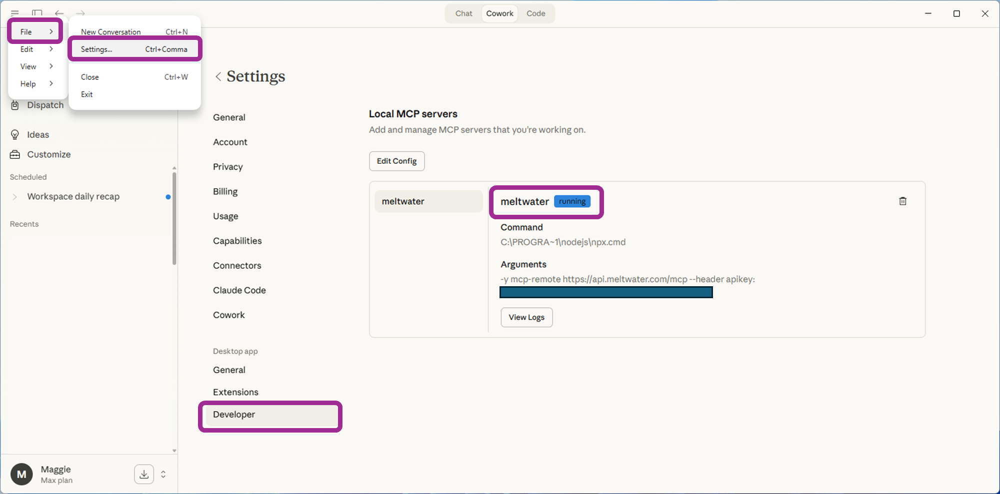
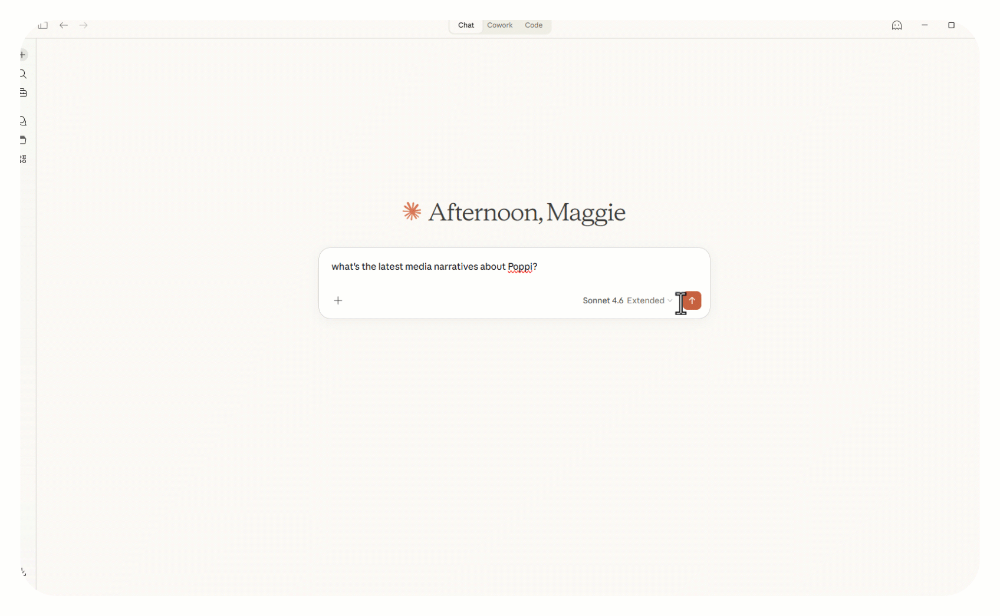
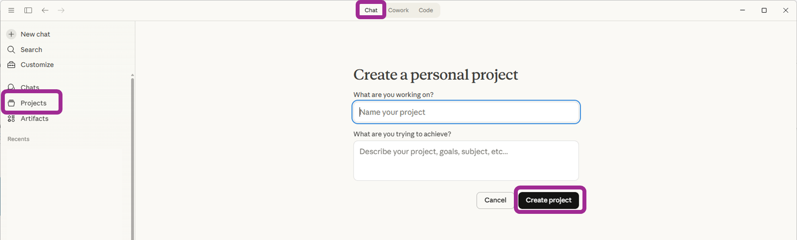
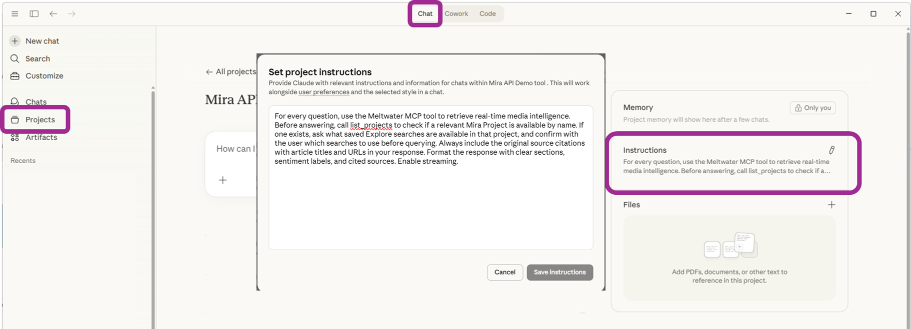
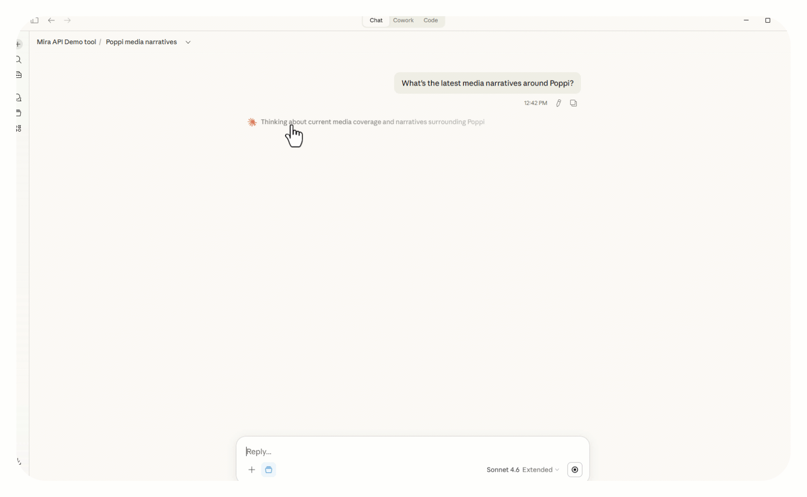
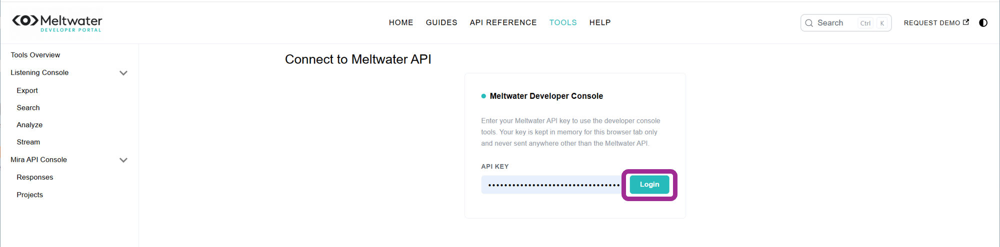
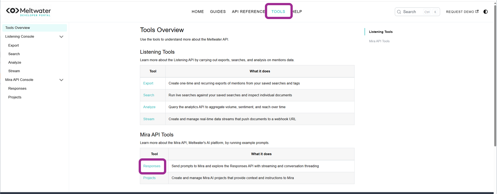
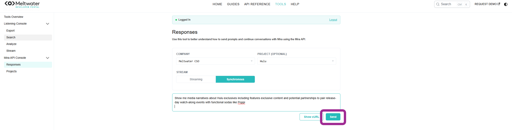
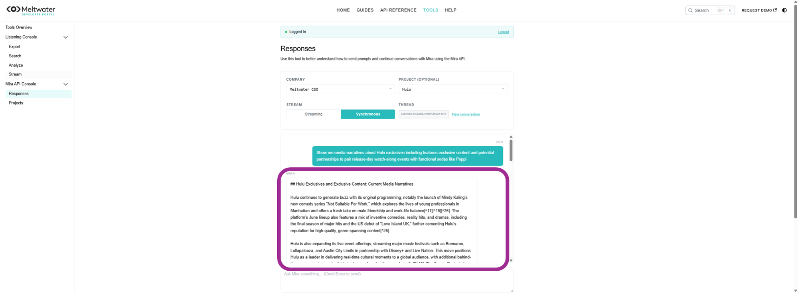
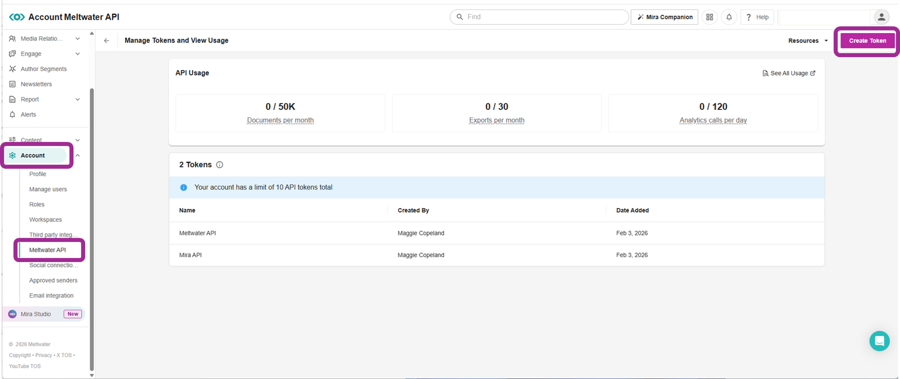

# Mira API MCP Server: Setup & Testing Guide

**Internal Only.**
Product Marketing | March 2026

---

## What is this guide?

A step-by-step guide for connecting the Mira API to an MCP-compatible tool and verifying it works. There are two ways to access the Mira API:

1. **MCP connection.** Connect an AI tool (like Claude Desktop) to the Mira API so you can query Meltwater in natural language from inside the tool. *(See [Option 1](#option-1-mcp-setup-claude-desktop).)*
2. **Developer page.** Test the Responses endpoint directly with a single API call, no local setup required. *(See [Option 2](#option-2-test-from-the-developer-page-no-local-setup).)*

**What's inside:**

- [Key Terms](#key-terms): quick definitions, collapsed by default
- [How MCP connects to the Mira API](#how-mcp-connects-to-the-mira-api): the REST vs. MCP picture
- [Option 1: MCP Setup (Claude Desktop)](#option-1-mcp-setup-claude-desktop): 7-step connection walkthrough
- [Option 2: Test from the Developer Page](#option-2-test-from-the-developer-page-no-local-setup): one API call, no setup
- [Troubleshooting](#troubleshooting): common issues and fixes
- [Resources](#resources): developer docs links

---

## Key Terms

<details>
<summary><strong>Expand key terms</strong></summary>

| Term | What it means |
| --- | --- |
| **Mira API** | The way customers connect Mira AI into their own tools. Instead of logging into Meltwater, their systems ask Meltwater questions directly and get answers back. |
| **MCP (Model Context Protocol)** | A plug that connects an AI tool to a data source. Plug it in, and the AI tool can talk to Meltwater. It's an open standard any AI tool can support. |
| **MCP server** | The connector file that tells an AI tool how to reach the Mira API. A small config file, about five minutes to set up. |
| **MCP-compatible tool** | Any AI assistant that supports MCP connections: Claude Desktop, Cursor, and others. |
| **Mira Project** | A saved set of context in Meltwater (brand, competitors, topics, filters) that makes Mira AI's responses more relevant without repeating background info in every prompt. Can also include saved Explore searches, giving Mira AI a curated set of results to draw from. |
| **Claude Desktop Project** | Saved instructions inside Claude Desktop that tell Claude how to behave in a conversation. **Not the same as a Mira Project.** You'll use one to tell Claude to automatically find your Mira Projects and use their saved searches. See [Step 7](#step-7-set-up-a-claude-desktop-project-for-better-results). |
| **Streaming** | When the response appears word by word in real time (like ChatGPT) instead of loading all at once. |

</details>

---

## How MCP connects to the Mira API

Think of the Mira API as the kitchen: same intelligence, same cited responses, however you get it. There are two ways to get a meal out of it. With **REST** ([Option 2](#option-2-test-from-the-developer-page-no-local-setup)), you buy the groceries and follow the recipe yourself: your code makes the API calls and assembles the response. With **MCP** ([Option 1](#option-1-mcp-setup-claude-desktop)), it's delivery. The finished result arrives inside the tools your team already has open, no assembly required. Same food, different amount of work on your end.


---

## Option 1: MCP Setup (Claude Desktop)

The Mira API MCP server works with any MCP-compatible tool (Claude Desktop, Cursor, and others). The setup is the same everywhere: point your tool's MCP config at the Meltwater server and add your API key. This walkthrough uses Claude Desktop as the example, in seven steps. On a different tool, the config block in [Step 4](#step-4-paste-the-config) is identical; only the config file's location and the way you view active servers will differ, so check your tool's MCP docs for those two details.

> Personal note: I connected the Mira API on my second day using an AI tool, with zero technical background. If I can do it, you can too. 🐥

### Step 1: Install Node.js (if you don't have it)

The MCP connection needs Node.js to run. It's the one thing the Developer docs don't mention that will trip you up.

1. Go to [nodejs.org](https://nodejs.org).
2. If unsure whether you already have it, just download and install the **LTS** version. It won't cause issues if it's already there.
3. Run the installer and accept the defaults.

**Windows users:** After installing, restart your computer before continuing. Windows needs a full restart to update the system PATH so Claude Desktop can find Node.js. Restarting just Claude Desktop is not enough.

### Step 2: Get your Meltwater API key

Find or create your token under **Account > Meltwater API** in your buddy account (see [Troubleshooting #1](#troubleshooting) or the [API Credentials page](https://developer.meltwater.com/guides/getting-started/api-credentials)). Copy it somewhere safe.

**Never share or display your API key on screen during a live call or recording.** Hide or obfuscate it before showing any config files or browser tabs.

### Step 3: Open the Claude Desktop config file

Easiest: in Claude Desktop, go to **Settings > Developer > Edit Config**. If that doesn't work, open the file manually:

- **Mac:** `~/Library/Application Support/Claude/claude_desktop_config.json`
- **Windows:** `%APPDATA%\Claude\claude_desktop_config.json`

### Step 4: Paste the config

The config is like a contact card. It tells Claude Desktop where Meltwater lives, how to get in (your API key), and what language to speak (MCP). Replace everything in the file with the config for your OS, swapping in your real API key:

<details>
<summary><strong>Mac config</strong></summary>

```json
{
  "mcpServers": {
    "meltwater": {
      "command": "npx",
      "args": [
        "-y",
        "mcp-remote",
        "https://api.meltwater.com/mcp",
        "--header",
        "apikey: ${MELTWATER_API_KEY}"
      ],
      "env": {
        "MELTWATER_API_KEY": "<your api key>"
      }
    }
  }
}
```

</details>

<details>
<summary><strong>Windows config</strong></summary>

```json
{
  "mcpServers": {
    "meltwater": {
      "command": "C:\\Program Files\\nodejs\\npx.cmd",
      "args": [
        "-y",
        "mcp-remote",
        "https://api.meltwater.com/mcp",
        "--header",
        "apikey:%MELTWATER_API_KEY%"
      ],
      "env": {
        "MELTWATER_API_KEY": "<your api key>"
      }
    }
  }
}
```

**Why Windows is different:** it needs the full path to `npx.cmd` (Claude Desktop may not resolve plain `npx`) and uses `%VARIABLE%` syntax instead of `${VARIABLE}`. If you installed Node.js to a custom location, replace the path with the actual path to `npx.cmd` on your machine.

</details>

### Step 5: Save and restart

Save the file, then:

- **Mac:** Fully quit and reopen Claude Desktop.
- **Windows:** Restart your computer. A full restart ensures Windows picks up the config and any PATH updates from Node.js. Restarting just Claude Desktop may not be enough.

Then go to **Settings > Developer** and confirm you see "meltwater" listed as an active MCP server. That's how you know the config loaded.



If you don't see it, check [Troubleshooting](#troubleshooting) before moving on.

### Step 6: Verify it works

Open a new conversation. There's no special command. Just type a question in plain language, like *"What are the top media narratives around Nike in the last 7 days?"* Claude recognizes the question needs Meltwater data and calls the MCP tool automatically. You'll see an accordion expand showing the tool being called. Once the response comes back with cited sources, you're good.



### Step 7: Set up a Claude Desktop Project for better results

**"Project" here means a Claude Desktop Project, not a Mira Project.** A Claude Desktop Project holds instructions for how Claude behaves. A Mira Project is optional context that scopes results to a specific brand, competitor set, or topic. You only need one if you want to narrow the response to a particular brand setup.

Without a Claude Desktop Project, Claude may skip source links, return flat text, or not know how to use your Mira Projects. Setting one up takes about two minutes and makes every response richer.

*On other MCP tools:* the equivalent is custom instructions or a system prompt. Paste the same guidance from 7.3 there.

**7.1.** In Claude Desktop, go to **Projects** in the sidebar.

**7.2.** Click **Create a new project** (e.g., "Mira API Demo").



**7.3.** In the Project instructions, paste the following:

```text
For every question, use the Meltwater MCP tool to retrieve real-time media intelligence. Before answering, call list_projects to check if a relevant Mira Project is available by name, then use that project's ID to list the saved Explore searches for the user to confirm when querying. Always include the original source citations with article titles and URLs in your response. Format the response with clear sections, sentiment labels, and cited sources. Enable streaming.
```



**7.4.** Save the Project and select it before running your prompts.

**What this does.** When you ask something like *"What are the recent media narratives around Poppi?"*, Claude will:

1. Call `list_projects` to check if a Mira Project for Poppi exists.
2. If so, pull its ID and list the saved Explore searches attached to it.
3. Confirm which searches to use before querying.
4. Call `ask` with the project ID, grounding the response in your brand setup.
5. Return a structured, cited response with sentiment labels and source URLs.

If no Mira Project exists for the brand, Claude still answers. It just draws from the full Meltwater dataset instead of a scoped project. Behind the scenes, the MCP server exposes exactly two tools: `list_projects` and `ask`.



**Why it matters:** without a Claude Desktop Project, you'd have to tell Claude what to do in every prompt. With it, Claude already knows to find your Mira Projects, use your saved searches, and format with citations. Type a question, get a fully sourced answer.

---

## Option 2: Test from the Developer Page (no local setup)

To test the Mira API without installing anything, use the interactive **Mira API Console** on the Developer Portal. It lets you send prompts to the Responses endpoint and read Mira's answers right in the browser, no code required. For the full request and response format (streaming, threading, citations), see the [Responses guide](https://developer.meltwater.com/guides/mira-api/responses).

You'll need your API key from your buddy account (see [Troubleshooting #1](#troubleshooting)).

1. Go to the **Tools** tab on the Developer Portal. On the "Connect to Meltwater API" screen, paste your API key and click **Login**. Your key stays in that browser tab's memory only and is never sent anywhere except the Meltwater API.
2. From **Tools Overview**, under **Mira API Tools**, click **Responses**.
3. Choose your **Company**, optionally a **Project** to scope results to a brand, and a **Stream** mode (Streaming or Synchronous). Type your prompt and click **Send**. To grab the underlying API request, click **Show cURL**.
4. Mira's response appears inline with cited sources. Keep the conversation going in the same **Thread**, or click **New conversation** to start fresh.

The response contains structured analysis organized by themes, with sentiment labels and cited sources: the intelligence layer with citations, not raw article text.

<details>
<summary><strong>Developer Console walkthrough (screenshots)</strong></summary>

| Step | Screenshot |
| --- | --- |
| **1. Log in with your API key** |  |
| **2. Open Responses under Mira API Tools** |  |
| **3. Set Company, Project, and Stream, enter your prompt, and Send** |  |
| **4. Read Mira's response and continue the thread** |  |

</details>

---

## Troubleshooting

<details>
<summary><strong>Expand troubleshooting</strong></summary>

| Issue | Fix |
| --- | --- |
| **1. "I don't have an API key."** | You should already have access through your buddy account; full steps are on the [API Credentials page](https://developer.meltwater.com/guides/getting-started/api-credentials). Quick version: 1) Log into your Meltwater buddy account. 2) In the left sidebar, go to **Account > Meltwater API**. 3) Existing tokens are listed under **Tokens**; for a new one click **Create Token** (red button, top right). 4) Name it something descriptive and click OK. 5) Copy it immediately; you won't be able to see it again after leaving the page. If you don't see "Meltwater API" in your sidebar, reach out to support. *Customer-facing note: customers receive their API key during onboarding after purchase, not during the sales process.*<br><br> |
| **2. "My MCP tool isn't connecting to Meltwater."** | Check these in order: 1) **Is Node.js installed?** If you skipped [Step 1](#step-1-install-nodejs-if-you-dont-have-it), install the LTS version from [nodejs.org](https://nodejs.org). 2) **Is your API key correct?** Make sure the key in the config matches the token from your buddy account; copy-paste it again to be safe. 3) **Did you restart?** The config only loads on startup; fully quit and reopen. **On Windows, restart your entire computer**, especially after installing Node.js. 4) **Right config for your OS?** The most common Windows issue is using the Mac config (`"command": "npx"`) instead of the full path to `npx.cmd`. 5) **Is the config valid JSON?** A missing comma or bracket breaks it silently; if unsure, delete everything and re-paste the full block from [Step 4](#step-4-paste-the-config). If none of that works, delete the config, restart, re-add it, and restart again. |
| **3. "How do I set up MCP in the first place?"** | Follow [Option 1](#option-1-mcp-setup-claude-desktop) above. For the Developer docs version, see the [MCP Server guide](https://developer.meltwater.com/guides/mira-api/mcp-server). Note: it leads with an OpenAI example, so scroll to "Integrating with Claude Desktop" for the config you need. |
| **4. "I got an error about npx or mcp-remote not being found."** | Node.js isn't installed, or Claude Desktop can't find it on your PATH. **Mac:** reinstall the LTS version from [nodejs.org](https://nodejs.org), then restart Claude Desktop. **Windows:** confirm Node.js is installed; if it is, your config probably uses `"command": "npx"` instead of the full path, so switch to the Windows config from [Step 4](#step-4-paste-the-config) (`"C:\\Program Files\\nodejs\\npx.cmd"`), then restart your computer. |
| **5. "The response came back empty or with an error."** | Usually your API key is expired/invalid, or your prompt quota is reached. Flag it to the Solutions Agent in Slack to confirm your key is active and your account has remaining prompts. |
| **6. "The response is too generic or missing brand context."** | Set up a Mira Project for the brand. Without one, Mira AI answers from the prompt alone; with one, it pulls in your saved brand context, competitors, and filters automatically. |
| **7. "The response is slow or erroring during heavy testing."** | The MCP server is limited to **60 requests per minute**, shared with the Responses endpoint. Space out back-to-back test prompts. Conversations hold up to **290,000 tokens** of history before older messages get trimmed. |
| **8. "I'm on Windows and it still isn't working after all the steps."** | 1) Confirm you used the **Windows config** from [Step 4](#step-4-paste-the-config), not the Mac version (full path to `npx.cmd`, `%VARIABLE%` syntax). 2) If Node.js is in a non-default location, update the `"command"` path to match. 3) Restart your entire computer after config changes, not just Claude Desktop; Windows often needs a full restart to pick up PATH and environment changes. |

</details>

---

## Resources

**Developer Documentation**
[Mira API Overview](https://developer.meltwater.com/guides/mira-api/overview) | [Responses](https://developer.meltwater.com/guides/mira-api/responses) | [MCP Server](https://developer.meltwater.com/guides/mira-api/mcp-server) | [Projects](https://developer.meltwater.com/guides/mira-api/projects) | [API Credentials](https://developer.meltwater.com/guides/getting-started/api-credentials) | [API Reference](https://developer.meltwater.com/api-reference/api-reference-overview)

*Questions or feedback? Reach out to PMM in #product-api.*

*Co-authored with Claude, Anthropic*
